# Job Pipeline with Monitoring - Complete Project Outline

## Project Overview
Build a complete job data processing pipeline first, then implement comprehensive monitoring and alerting system to ensure production readiness and operational excellence.

## Project Architecture

```mermaid
graph TB
    %% Data Sources
    subgraph "Data Sources"
        A[Apify API<br/>Job Scraping]
        B[OpenAI API<br/>Content Analysis]
    end

    %% Processing Pipeline
    subgraph "Data Processing Pipeline"
        C[job_collector.py<br/>Lambda Function]
        D[SQS Queue<br/>Message Distribution]
        E[job_processing.py<br/>AI Analysis Engine]
        F[job_consumer.py<br/>Final Processing]
    end

    %% Data Layer
    subgraph "Data Layer"
        G[(PostgreSQL Neon<br/>Primary Database)]
    end

    %% Monitoring & Observability
    subgraph "Monitoring & Observability"
        H[CloudWatch Metrics<br/>• Lambda Success Rates<br/>• SQS Queue Health<br/>• Database Performance<br/>• API Response Times]
        I[CloudWatch Alarms<br/>• Error Rate Thresholds<br/>• Queue Depth Limits<br/>• Performance Degradation]
        J[SNS Notifications<br/>• Email Alerts<br/>• Slack Integration<br/>• SMS Critical Alerts]
        K[Custom Dashboards<br/>• Real-time Pipeline Status<br/>• Business Metrics<br/>• Cost Monitoring]
    end

    %% Data Flow
    A --> C
    B --> E
    C --> D
    D --> E
    E --> F
    F --> G
    C --> G

    %% Monitoring Flow
    C --> H
    E --> H
    F --> H
    D --> H
    G --> H
    H --> I
    I --> J
    H --> K

    %% Developer Feedback Loop
    J --> DEV[Developer<br/>Immediate Feedback]
    K --> DEV

    %% Styling
    classDef source fill:#f3e5f5,stroke:#7b1fa2
    classDef process fill:#fff3e0,stroke:#f57c00
    classDef queue fill:#e8f0ff,stroke:#1565c0
    classDef data fill:#e8f5e8,stroke:#388e3c
    classDef monitor fill:#fce4ec,stroke:#c2185b
    classDef alert fill:#ffebee,stroke:#d32f2f

    class A,B source
    class C,E,F process
    class D queue
    class G data
    class H,I,K monitor
    class J,DEV alert
```

## Project Phases

### Phase 1: Environment Setup & Foundation 🏗️
**Duration:** 1 week | **Focus:** Development Environment & Core Infrastructure

#### 1.1 Development Environment
- AWS account configuration and IAM roles setup
- Development environment (WSL, Python, AWS CLI)
- Git repository and version control setup

#### 1.2 Database Foundation
- PostgreSQL Neon database setup and configuration
- Database schema creation and table setup
- Connection management and basic database operations

#### 1.3 Core Dependencies
- Python environment and package management
- AWS Lambda packaging and deployment setup
- Basic project structure and configuration

**Deliverables:**
- ✅ Working development environment
- ✅ Database setup and schema
- ✅ Basic project structure

---

### Phase 2: Data Collection Pipeline 📊
**Duration:** 2-3 weeks | **Focus:** Complete Job Collection System

#### 2.1 Job Collector Implementation
- `job_collector.py` Lambda function development
- Apify API integration and job scraping logic
- Job data processing and validation
- Duplicate detection and filtering

#### 2.2 Database Operations
- Job insertion and storage logic
- Database connection pooling
- Data validation and error handling
- Schema optimization and indexing

#### 2.3 SQS Message Queue System
- SQS queue setup and configuration
- Message publishing for downstream processing
- Dead letter queue setup
- Queue management utilities (`sqs_manager.py`)

**Deliverables:**
- ✅ Complete job collection Lambda function
- ✅ Working SQS message system
- ✅ Database storage with validation

---

### Phase 3: AI Processing Pipeline 🤖
**Duration:** 2-3 weeks | **Focus:** Job Analysis and Processing

#### 3.1 OpenAI Integration
- `job_processing.py` Lambda function development
- OpenAI API integration and prompt engineering
- Job description analysis and data extraction
- Structured data output and validation

#### 3.2 Processing Logic
- SQS message consumption and processing
- Job data enrichment with AI analysis
- Database updates with processed information
- Error handling and retry logic

#### 3.3 Consumer Pipeline
- `job_consumer.py` implementation
- Final processing and cleanup operations
- End-to-end pipeline completion
- Data quality validation

**Deliverables:**
- ✅ Complete AI processing system
- ✅ End-to-end pipeline functionality
- ✅ Working job analysis and enrichment

---

### Phase 4: Pipeline Testing & Optimization ⚡
**Duration:** 1-2 weeks | **Focus:** Performance and Reliability

#### 4.1 End-to-End Testing
- Complete pipeline testing with real data
- Performance testing and bottleneck identification
- Error scenario testing and validation
- Load testing with varying job volumes

#### 4.2 Performance Optimization
- Lambda function optimization and memory tuning
- Database query optimization and indexing
- SQS configuration tuning
- Cost optimization and resource efficiency

#### 4.3 Production Deployment
- AWS Lambda deployment and configuration
- Production environment setup
- Security hardening and best practices
- Documentation and deployment guides

**Deliverables:**
- ✅ Fully tested and optimized pipeline
- ✅ Production deployment ready
- ✅ Performance benchmarks established

---

### Phase 5: Comprehensive Monitoring System 📈
**Duration:** 2-3 weeks | **Focus:** Observability and Alerting

#### 5.1 Core Monitoring Infrastructure
- CloudWatch metrics and logs setup
- Custom metrics for business logic monitoring
- Log aggregation and structured logging
- Monitoring data collection for all components

#### 5.2 Health Monitoring

**Lambda Function Monitoring:**
- Execution success/failure rates
- Duration and performance metrics
- Memory usage and optimization insights
- Error categorization and trending

**SQS Queue Monitoring:**
- Queue depth and message age tracking
- Processing throughput metrics
- Dead letter queue monitoring
- Message processing success rates

**Database Monitoring:**
- Connection health and pool utilization
- Query performance and slow query detection
- Database resource utilization
- Transaction success rates

**External API Monitoring:**
- Apify API response times and success rates
- OpenAI API quota usage and performance
- Rate limiting and error handling
- Service availability tracking

#### 5.3 Alerting and Notification System
- SNS topic configuration for alerts
- Multi-channel notifications (email, Slack, SMS)
- Alert severity levels and escalation procedures
- Automated alert routing and acknowledgment

**Deliverables:**
- ✅ Complete monitoring infrastructure
- ✅ Real-time health tracking for all components
- ✅ Automated alerting system

---

### Phase 6: Advanced Monitoring & Operational Excellence 🚀
**Duration:** 1-2 weeks | **Focus:** Production Operations

#### 6.1 Advanced Alerting

**Critical Alerts (Immediate Response):**
- Lambda functions failing >50% of invocations
- SQS queue depth exceeding 1000 messages
- Database connection failures
- Complete API service outages

**Warning Alerts (Investigation Needed):**
- Lambda cold starts increasing significantly
- Queue processing lag >30 minutes
- Database slow query patterns
- API rate limit approaches (>80% quota)

**Info Alerts (Trend Monitoring):**
- Daily job processing volume changes
- Cost threshold notifications
- Performance trend degradation

#### 6.2 Operational Dashboards
- **Executive Dashboard:** Business metrics and KPIs
- **Operations Dashboard:** Real-time system health
- **Developer Dashboard:** Debugging and troubleshooting tools
- **Cost Dashboard:** Resource usage and optimization

#### 6.3 Incident Response
- Incident response procedures and runbooks
- Automated remediation for common issues
- Escalation procedures and on-call setup
- Post-incident analysis and improvement processes

**Deliverables:**
- ✅ Production-ready monitoring system
- ✅ Comprehensive operational dashboards
- ✅ Incident response procedures

---

## Key Success Metrics & Deliverables

### Technical Deliverables
- **Complete Data Pipeline:** Job collection → AI processing → Database storage
- **Comprehensive Monitoring:** Real-time health tracking for all components
- **Automated Alerting:** Multi-channel notifications with escalation procedures
- **Operational Dashboards:** Executive, operational, and developer views
- **Documentation:** Architecture diagrams, runbooks, and troubleshooting guides

### Business Deliverables
- **Processing Capacity:** Handle 1000+ jobs per hour with <5% error rate
- **System Reliability:** 99.5% uptime with automated recovery
- **Cost Optimization:** Track and optimize cost per job processed
- **Data Quality:** Automated validation and quality scoring
- **Incident Response:** <15 minute detection and <1 hour resolution for critical issues

### Learning Outcomes
- **End-to-End Pipeline Development:** Complete data processing system implementation
- **Production Operations:** Real experience with system monitoring and incident response
- **AWS Services Mastery:** Lambda, SQS, CloudWatch, SNS, RDS integration
- **Performance Optimization:** Identify and resolve bottlenecks using monitoring data
- **Cost Management:** Track and optimize cloud resource costs

## Project Success Criteria

### Pipeline Phase Success (Phases 1-4):
- ✅ Complete job collection system processing 1000+ jobs/hour
- ✅ AI-powered job analysis with structured data extraction
- ✅ End-to-end pipeline with <5% error rate
- ✅ Production deployment with optimized performance

### Monitoring Phase Success (Phases 5-6):
- ✅ Real-time monitoring of all pipeline components
- ✅ Automated alerting with <15 minute detection time
- ✅ Comprehensive dashboards for operations and debugging
- ✅ Incident response procedures with <1 hour resolution

### Final Deliverables:
- **Complete Data Pipeline:** Fully functional job processing system
- **Monitoring System:** Comprehensive observability and alerting
- **Operational Tools:** Dashboards, runbooks, and procedures
- **Documentation:** Architecture guides and troubleshooting manuals
- **Production System:** Scalable, monitored, and maintainable solution

## Implementation Strategy

This approach builds the complete data pipeline first, ensuring core functionality works reliably, then adds comprehensive monitoring to make it production-ready with full observability and operational excellence.

### Key Benefits:
1. **Focused Development:** Build core functionality without monitoring complexity
2. **Iterative Improvement:** Add monitoring after understanding system behavior
3. **Clear Milestones:** Each phase has concrete, testable deliverables
4. **Production Readiness:** Final system includes comprehensive monitoring and operations
5. **Learning Path:** Natural progression from development to operations

### Unique Value Proposition:
This project provides hands-on experience with both building scalable data pipelines AND operating them in production with comprehensive monitoring and alerting systems, preparing developers for real-world cloud engineering roles.
